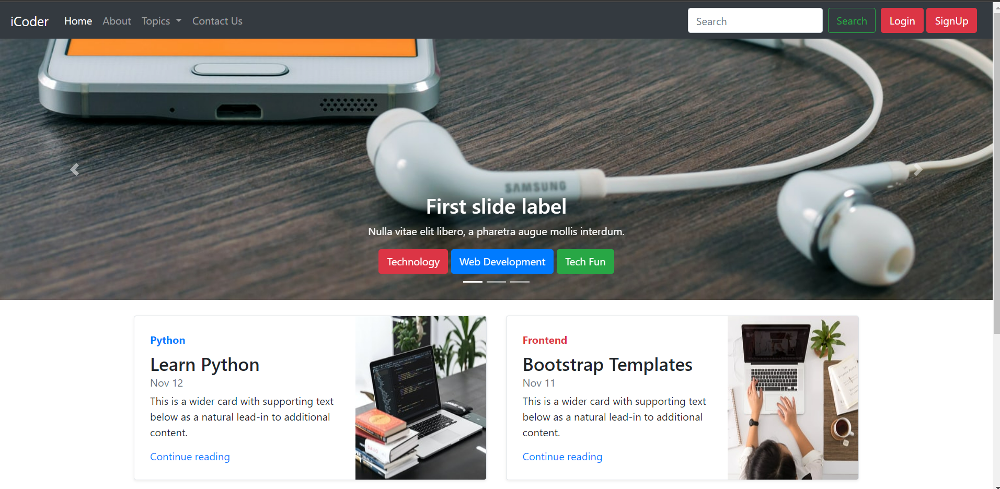

# iCoder-Bootstrap

> This is the iCoder Website build using Bootstrap.

---

### Table of Contents
You're sections headers will be used to reference location of destination.

- [Description](#description)
- [How To Use](#how-to-use)
- [Author Info](#author-info)

---

## Description

This is a iCoder website, you can get to experience UI of a Tech blog.

#### Technologies

- Html
- Bootstrap
- Github

[Back To The Top](#read-me-template)

---

## How To check

#### Link

Open website [iCoder-Bootstrap.com](https://kady2023.github.io/iCoder-Bootstrap/)

[Back To The Top](#read-me-template)

---

## Author Info

- Twitter - [@kady_2023](https://twitter.com/kady_2023)
- Linkedin - [@nitin-kadyan](https://www.linkedin.com/in/nitin-kadyan)

[Back To The Top](#read-me-template)
